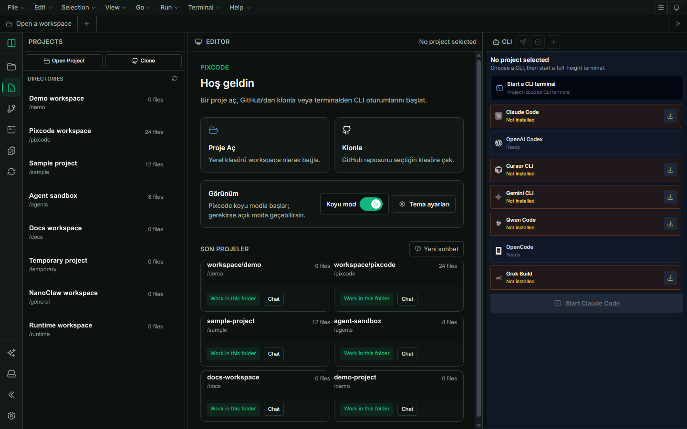
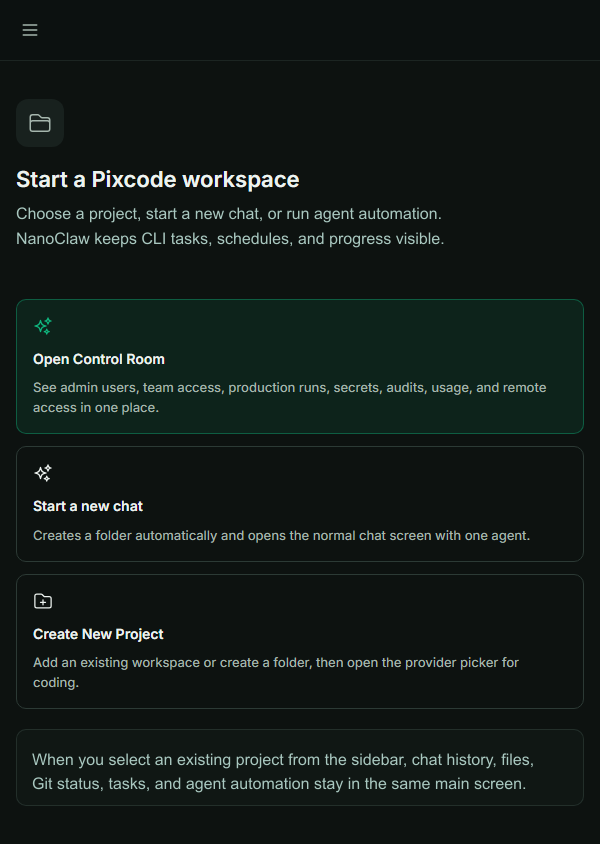

<div align="center">
  
  <h1>Pixcode</h1>
  <p><strong>面向 AI coding agent 的 self-hosted control room。</strong></p>
  <p>
    在一个 Web UI 中使用 Claude Code、Cursor CLI、Codex、Gemini CLI、Qwen Code 和 OpenCode，并集成 chat、shell、files、Git、orchestration、API keys、plugins、notifications、Telegram、desktop/server deployment。
  </p>
  <p>
    <a href="https://buymeacoffee.com/alicomert" target="_blank" rel="noopener noreferrer"></a>
  </p>
  <p>
    <a href="README.md">English</a> ·
    <a href="README.tr.md">Türkçe</a> ·
    <a href="README.de.md">Deutsch</a> ·
    <a href="README.ru.md">Русский</a> ·
    <a href="README.ja.md">日本語</a> ·
    <a href="README.ko.md">한국어</a>
  </p>
</div>

## Pixcode 是什么？

Pixcode 可以把你的本机、工作站或 Linux 服务器变成浏览器里的 AI development cockpit。你不需要在多个 terminal、CLI logs、file explorer、Git UI、provider settings 之间切换，Pixcode 把 coding-agent workflow 放在一个本地 Web App 里。

常见使用方式：

- **Local workstation**：在自己的电脑上运行 Pixcode，用更好的 UI 操作已有 CLI。
- **Always-on server**：在 Linux/VDS 上以 daemon 方式运行，从 laptop、tablet、phone 访问。
- **Desktop app**：使用 GitHub Releases 中的 Windows `.exe`、macOS `.dmg`、Linux build。

Pixcode 不是 hosted cloud IDE。Projects、credentials、CLI sessions、local files、Git state、MCP config 默认都保留在你的机器上。

## Screenshots

| Workspace | Mobile chat |
| --- | --- |
|  |  |

| CLI selection | Tools and MCP |
| --- | --- |
|  |  |

## 功能亮点

### 多个 CLI，一个界面

- Claude Code、Cursor CLI、Codex、Gemini CLI、Qwen Code、OpenCode。
- Settings 中管理 provider auth、API key credentials、OAuth paste、install status、model list、CLI version status。
- Pixcode 不替代 native CLI，而是在其上增加 session management、WebSocket streaming、notifications、file context、project controls。
- UI 会显示 CLI 是在 thinking、tool execution、approval waiting 还是 output streaming。

### Chat、files、shell、source control

- Project-aware chat sessions 和 history。
- Prompt composer 固定在 chat/project screen 底部。
- Shell panel 在 desktop 上可作为 split panel 或 full panel 打开。
- File browser 支持 edit、upload、rename、delete、detailed view。
- Source Control 支持 Git status、diff、branch、commit、changed files。
- Split panels 提供 icon controls、close button、mobile-friendly responsive behavior。

### Changed files Command Center

Pixcode 会跟踪 local working tree 的变化。Quick Settings 中的 Command Center 可以即时显示 changed files，高亮新的改动，并跳转到相关 file/line。这样 AI agent 修改文件时，你可以看到它改了什么，同时保持 chat/orchestration view 不被关闭。

### Multi-agent orchestration

Orchestration 可以让多个 CLI agents 围绕同一个 goal 协作。

- **Agent Team**：按 frontend、backend、review、docs、custom role 拆分任务。
- **Multi-model Review**：用多个 provider/model 检查同一改动。
- **Sequential Handoff**：按阶段交接任务。
- **Decision Debate**：实现前比较不同 approach。

Controls:

- 按 run enable/disable agents，
- 同一个 provider 可创建多个 worker，
- agent 级 role、stage、label、instruction，
- agent 级 model selection，包含 OpenCode model，
- failed step 的 fallback CLI agent，
- workflow DAG preview，
- event streaming 和 cancel，
- resizable orchestration panes。

### API、Telegram、notifications

Pixcode frontend 本身使用 REST/WebSocket API。External automation 也可以用 Pixcode API key 使用同一个 control plane。新的 API keys 以 `px_` 开头，旧的 `ck_` keys 仍然兼容。

```bash
curl http://localhost:3001/api/projects \
  -H "Authorization: Bearer px_your_key_here"
```

- `POST /api/agent` for one-shot agent runs.
- `/api/orchestration/workflows/*` for preview, start, stream, cancel.
- Browser push notifications.
- Telegram pairing、task notifications、optional prompt bridge。

OpenAPI: [`public/openapi.yaml`](public/openapi.yaml)

### Themes、plugins、MCP

- Dark/light mode。
- Emerald、VS Code-like accent palettes。
- Custom light/dark accent colors。
- Token-based styling for buttons、focus rings、navigation、active states。
- MCP server management。
- Plugin system with frontend tabs and optional backend services。

## Installation

需要 Node.js 22+。

```bash
npx @pixelbyte-software/pixcode
```

Global install:

```bash
npm install -g @pixelbyte-software/pixcode
pixcode
```

Open:

```text
http://localhost:3001
```

Desktop installers are available in GitHub Releases: Windows `.exe`, macOS `.dmg`, Linux AppImage/packages.

## Linux daemon

```bash
pixcode daemon install --mode auto --port 3001
pixcode daemon status --mode auto
pixcode daemon logs --mode auto
pixcode daemon restart --mode auto
```

Foreground:

```bash
pixcode --no-daemon
```

## Development

```bash
npm install
npm run typecheck
npm run lint
npm run build
```

Notes:

- `npm run dev` uses the daemon manager on Linux.
- Use `npm run client` only for Vite frontend development.
- Normal runtime uses port `3001`; `5173` is for separate Vite dev.

## Links

- npm: <https://www.npmjs.com/package/@pixelbyte-software/pixcode>
- GitHub: <https://github.com/alicomert/pixcode>
- Releases: <https://github.com/alicomert/pixcode/releases/latest>
